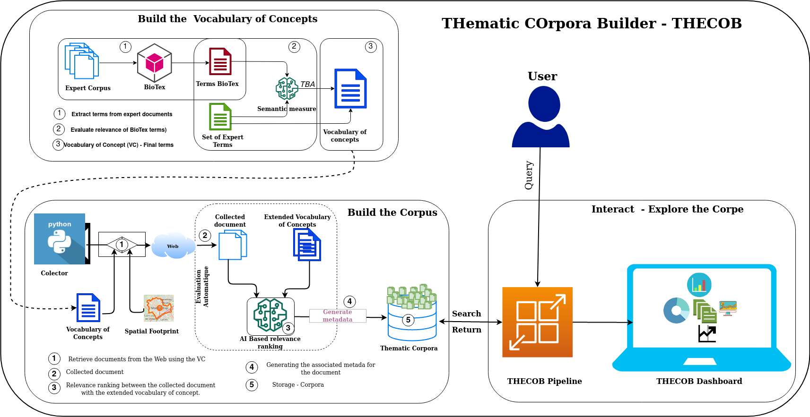

# herelles corpora consitution protocol
Automatic protocol for the constitution of spatio-temporal and thematic corpora for the Herelles project.



This protocol is designed for anchored spatiotemporal and thematic corpora constitution :

  * Build a corpus by specifying the thematic keyword, the spatial footprint (e.g, city or territory name).
  * Build automatically associated some metadata for each collected document such as the :
      * date of publication or modification
      * title
      * absolute spatiale named entities provided in the title of the document
      * pertinence of the document regarding the thematic (this is automatically evaluated during the scrapping...)
      * url
      * text
      * Etc.

## How does it work ?

=======Input=======

* vocabulary of thematic concepts (VC) : set of concepts that relies to a specific thematic (e.g. Urbanisation)

* spatial footprint : name of spatiale entity, can be a city name or a country.

=======Ouput=======

* Corpora : In .jsonl file containing the collected corpus


=======Document Scoring process=======

* To ensure the quality the collected document, we have set up an automated evaluation, based on the similarity measure based on Transformers model (we used DistilBert). This similarity measure is computed for each document, with an extended concept vocabulary. Why an extended vocabulary of concept ? We propose to use an extended vocabulary of concepts for each thematic during the collection, in order to be able to take into account documents of a societal nature, whose content contains a less formal language (socially oriented or language of the majority), generally coming from forums, blogs, etc. The extended concept is obtained by generating synonyms for each term in the initial vocabulary using WordNet.

* The most relevant documents are those with the highest similarity scores.


Quick start
-----------

Then clone the project: 
   ```python
   git clone https://github.com/rdius/herelles.git

   # You can specify your own vocabulary of concepts in the ./terms directory
   ```

Install the requiered packages:
   ```python
pip install -r requirements.txt

# Change the vocabulary of concept file and the spatial extent to your own in main.py.

from src.collector import scrapper

vcUrb = "./terms/urbanisme.txt"
vcRisq = "./terms/risque.txt"
spatial_extent = 'Montpellier'

# start scrapping
if __name__ == '__main__':
    print("scrapping...")
    scrapper(spatial_extent, vcRisq)
```
